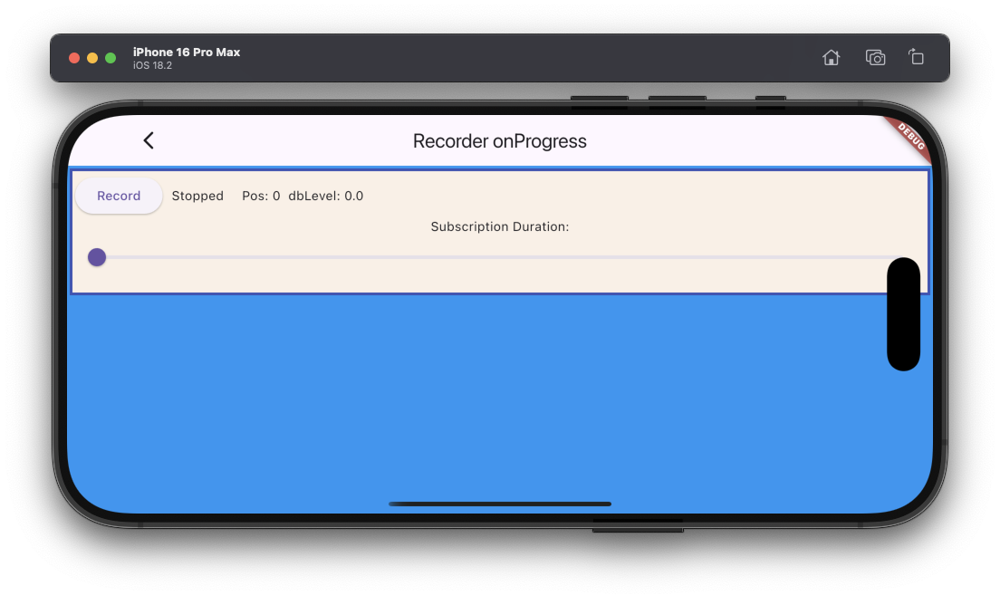

The example source [is there](https://github.com/canardoux/flutter_sound/blob/master/example/lib/recorder_onProgress/recorder_on_progress.dart). You can have a live run of the examples [here](/live/index.html).

This example shows how to use the verb [setSubscriptionDuration()](/api/recorder/FlutterSoundRecorder/setSubscriptionDuration.html) on a recorder for having an [onProgress](/api/recorder/FlutterSoundRecorder/onProgress.html) callback.
There is a slider to show are the playback frequency can be adjusted.

This example is really basic.

