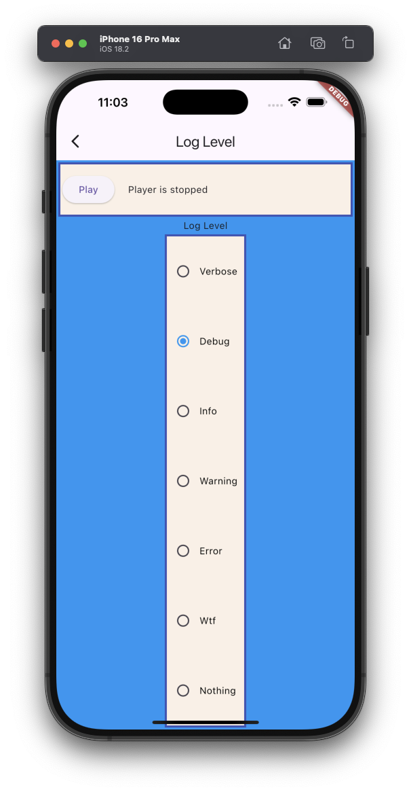

The example source [is there](https://github.com/canardoux/flutter_sound/blob/master/example/lib/loglevel/loglevel.dart). You can have a live run of the examples [here](/live/index.html).

This is a very simple basic example which allows the user to [select the Log Level](/api/player/FlutterSoundPlayer/setLogLevel.html) he/she is interested by.

